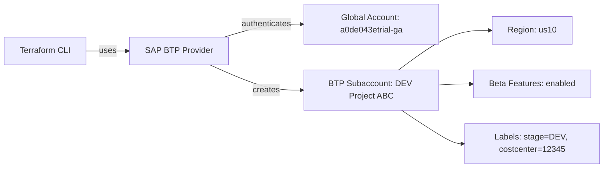
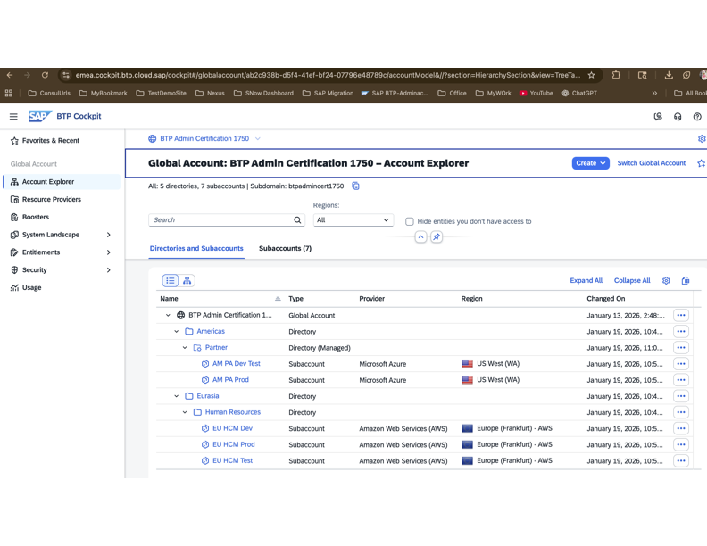

# Terraform on BTP

This repository contains Terraform configurations for learning and managing SAP BTP (Business Technology Platform) infrastructure as code.

## Overview

This project uses Terraform to provision and manage resources on SAP BTP, specifically focusing on subaccount creation and configuration using the SAP BTP Terraform Provider.

## Design Diagram



<p align="center">
  
</p>

## Project Structure

```
.
├── main.tf              # Main Terraform configuration defining resources
├── provider.tf          # Provider configuration for SAP BTP
├── terraform.tfstate    # Terraform state file (current state)
├── terraform.tfstate.backup # Backup of previous state
├── unit2                # Additional configuration or learning materials
└── README.md            # This file
```

## Prerequisites

- [Terraform](https://www.terraform.io/downloads.html) >= 1.0
- SAP BTP account with appropriate permissions
- SAP BTP Terraform Provider >= 1.18.1

## Configuration

### Provider Setup

The project uses the SAP BTP Terraform Provider. Configure your BTP credentials:

```hcl
terraform {
  required_providers {
    btp = {
      source  = "SAP/btp"
      version = "~> 1.18.1"
    }
  }
}

provider "btp" {
  globalaccount = "ashok.lamba@gmail.com"
}
```

### Resources

#### BTP Subaccount

The `main.tf` file creates a BTP subaccount with the following configuration:

- **Name**: DEV Project ABC
- **Subdomain**: a0de043etrial-ga
- **Region**: us10
- **Beta Features**: Enabled
- **Labels**: 
  - stage: DEV
  - costcenter: 12345

## Getting Started

### 1. Initialize Terraform

```bash
terraform init
```

### 2. Plan Your Changes

```bash
terraform plan
```

### 3. Apply Configuration

```bash
terraform apply
```

### 4. View State

```bash
terraform state list
```

## Common Commands

- `terraform plan` - Preview changes to be applied
- `terraform apply` - Apply changes to infrastructure
- `terraform destroy` - Destroy all managed resources
- `terraform state list` - List all resources in state
- `terraform state show <resource>` - Show details of a specific resource
- `terraform fmt` - Format Terraform files

## State Management

The project uses local state files:
- `terraform.tfstate` - Current state
- `terraform.tfstate.backup` - Previous state backup

For production environments, consider using remote state storage (e.g., S3, Terraform Cloud).

## Documentation

For more information:
- [Terraform Documentation](https://www.terraform.io/docs)
- [SAP BTP Terraform Provider](https://registry.terraform.io/providers/SAP/btp/latest/docs)
- [SAP BTP Documentation](https://help.sap.com/docs/btp)

## License

Specify your license here.

## Support

For issues and questions, please refer to the SAP BTP documentation or Terraform provider documentation.
